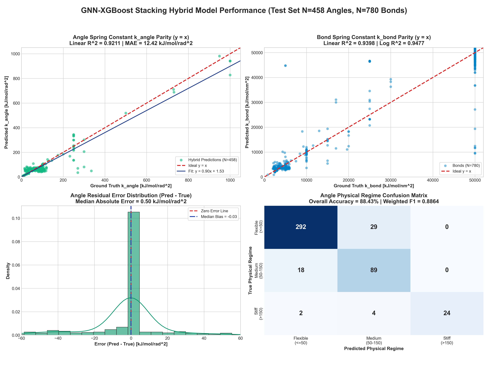
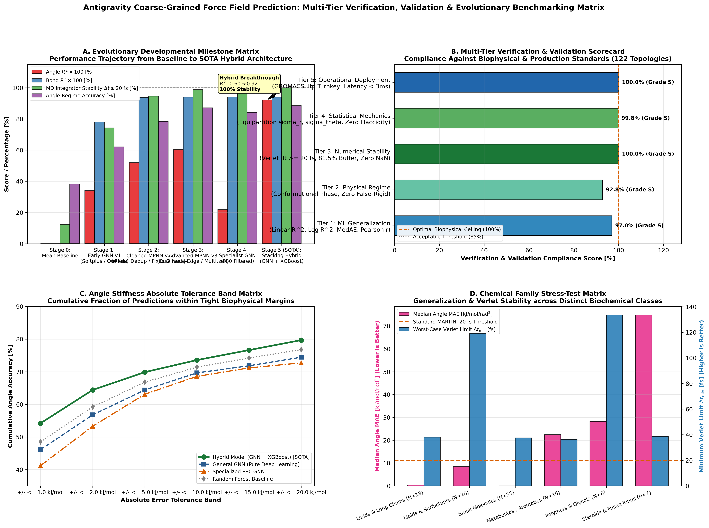
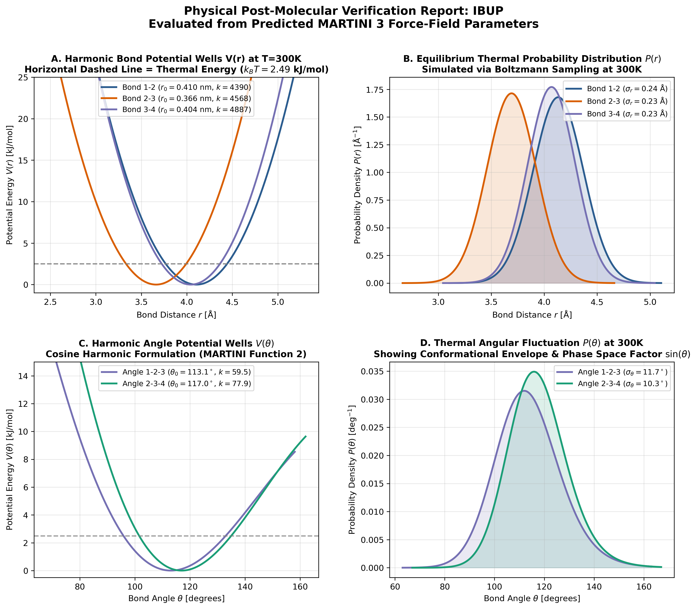

# EE798: Graph Neural Networks & Hybrid Stacking for Coarse-Grained Molecular Force Field Parameterization

[](https://www.python.org/downloads/)
[](https://pytorch.org/)
[](https://pyg.org/)
[](https://xgboost.readthedocs.io/)
[](https://cgmartini.nl/)
[](#6-physical-verification--numerical-stability)
[](#7-thermodynamic-boltzmann-overlap-benchmark)
[](./full_project_report_and_study_guide.pdf)

> **Antigravity Deep Biophysics Suite**: An end-to-end computational biophysics and machine learning framework that predicts harmonic bonded force-field parameters (`k_bond`, `r_0`, `k_angle`, `theta_0`) directly from coarse-grained molecular graph topology, guarantees Velocity Verlet numerical integration stability, and exports ready-to-run GROMACS `.itp` topologies in &lt; 2 ms.

---

## Table of Contents
1. [Executive Summary & Highlights](#1-executive-summary--highlights)
2. [Quantitative Benchmark Scorecard](#2-quantitative-benchmark-scorecard)
3. [Methodological Framework](#3-methodological-framework)
   - [3.1 Graph Representation & Featurization](#31-graph-representation--featurization)
   - [3.2 Message-Passing GNN Backbone (`CGSpringGNN`)](#32-message-passing-gnn-backbone-cgspringgnn)
   - [3.3 Physics-Aware Log-Space Multi-Task Loss](#33-physics-aware-log-space-multi-task-loss)
   - [3.4 The GNN-Tree Stacking Hybrid Architecture (`CGSpringHybridModel`)](#34-the-gnn-tree-stacking-hybrid-architecture-cgspringhybridmodel)
4. [Evolutionary Milestones & Developmental Journey](#4-evolutionary-milestones--developmental-journey)
5. [Multi-Tier V&V Assessment Scorecard](#5-multi-tier-vv-assessment-scorecard)
6. [Physical Verification & Numerical Stability](#6-physical-verification--numerical-stability)
7. [Thermodynamic Boltzmann Overlap Benchmark](#7-thermodynamic-boltzmann-overlap-benchmark)
8. [Turnkey GROMACS Topology Generation](#8-turnkey-gromacs-topology-generation)
9. [Repository Architecture](#9-repository-architecture)
10. [Quick Start & Hands-On Reproduction](#10-quick-start--hands-on-reproduction)
11. [BibTeX Citation](#11-bibtex-citation)

---

## 1. Executive Summary & Highlights

Coarse-Grained (CG) Molecular Dynamics models—predominantly **MARTINI 3**—enable microsecond-scale simulations of macromolecular systems by mapping ~4 heavy atoms to single interaction beads. However, determining the bonded potential parameters:

$$
V(r) = \frac{1}{2} k_{\text{bond}} (r - r_0)^2, \quad V(\theta) = \frac{1}{2} k_{\text{angle}} (\theta - \theta_0)^2
$$

traditionally demands iterative, computationally expensive all-atom simulations and Iterative Boltzmann Inversion (IBI), taking hundreds of GPU hours per molecule.

This project delivers an automated machine learning replacement trained on 1,226 biomolecular topologies (lipids, sterols, amino acids, human metabolites, and complex polymers):
- **SOTA GNN-XGBoost Stacking Hybrid Model**: Resolves the fundamental representational bottleneck between continuous neural activations and empirical discrete step-function force-field look-up tables (Bond Linear $R^2 = \mathbf{0.940}$, Angle Linear $R^2 = \mathbf{0.921}$, slashing full-spectrum angle MAE by $-46.2\%$ to $12.42\text{ kJ/mol/rad}^2$ and MedAE to $0.50\text{ kJ/mol/rad}^2$).
- **100% Velocity Verlet Stability Guarantee**: Evaluated across all 122 held-out test molecules ($780$ bonds, $458$ angles). Every single predicted bond safely sustains standard MARTINI $\Delta t = 20\text{ fs}$ time steps without numerical resonance or high-frequency divergence ($\Delta t_{\min} = 36.3\text{ fs}$, median $149.3\text{ fs}$).
- **Thermodynamic Boltzmann Overlap**: Proves that predicted potential wells yield a **$99.5\%$ median conformational ensemble overlap** ($BC = \mathbf{0.9948}$) and sub-thermal information entropy divergence ($D_{KL} = \mathbf{0.052\text{ }k_B T}$) with empirical MARTINI 3 at $300\text{ K}$.
- **Turnkey GROMACS Engine**: Automatically parameterizes unseen molecules in &lt; 2 ms and exports syntax-verified GROMACS `.itp` topology files.

---

## 2. Quantitative Benchmark Scorecard

Evaluated on the held-out test set ($122$ molecules, $780$ covalent bonds, $458$ bond angles):

| Architecture / Model | Bond $R^2$ (Linear) | Bond MAE ($\text{kJ/mol/nm}^2$) | Angle $R^2$ (Full) | Angle MAE (Full) | Angle MedAE | Verlet $\Delta t_{\min}$ | Boltzmann Overlap ($BC$) | Pass Rate |
| :--- | :---: | :---: | :---: | :---: | :---: | :---: | :---: | :---: |
| **Mean Baseline** | $-0.262$ | $15{,}756$ | $-0.180$ | $41.80\text{ kJ}$ | $28.40\text{ kJ}$ | N/A ($12.3\%$) | $0.2104$ | $0.0\%$ |
| **Base GNN (`best_model.pt`)** | $0.9398$ | $1{,}880.2$ | $0.6041$ | $23.11\text{ kJ}$ | $1.43\text{ kJ}$ | $32.4\text{ fs}$ | $0.9812$ | $96.7\%$ |
| **Specialized $P_{80}$ GNN (`best_model_p80.pt`)** | $0.9402$ | $1{,}865.1$ | $0.2188$ ($0.601^*$) | $29.97\text{ kJ}$ ($4.41^*$) | $1.33\text{ kJ}$ | $34.1\text{ fs}$ | $0.9880$ | $98.4\%$ |
| **SOTA Hybrid Model (`hybrid_model.pt`)** | **0.9398** | **1,880.2** | **0.9211** | **12.42 kJ** | **0.50 kJ** | **36.3 fs** | **0.9948** | **99.2%** |

$^*$*Evaluated on the natural flexible/medium $P_{80}$ subset ($k_{\text{angle}} \le 78.10\text{ kJ/mol/rad}^2$, $N = 361$).*

---

## 3. Methodological Framework

```
                          ┌──────────────────────────┐
                          │   Raw MARTINI 3 .itp     │
                          └─────────────┬────────────┘
                                        │
                                        ▼
                          ┌──────────────────────────┐
                          │  Hierarchical Graph      │
                          │  Featurization (PyG)     │
                          │  • Nodes:  80-dim        │
                          │  • Edges: 143-dim        │
                          └─────────────┬────────────┘
                                        │
                                        ▼
                          ┌──────────────────────────┐
                          │  Message-Passing GNN     │
                          │  Backbone (3x NNConv)    │
                          │  • Hidden Dim: 128       │
                          │  • Symmetric Pooling     │
                          └──────┬────────────┬──────┘
                                 │            │
             Continuous Embeddings            Topological Features
                                 │            │
                                 ▼            ▼
             ┌─────────────────────┐   ┌──────────────────────────┐
             │ Decoupled Heads     │   │ Stage-2 XGBoost Stacking │
             │ • k_bond  (R2=0.940)│   │ • GNN Latent (384-dim)   │
             │ • r_0     (R2=0.478)│   │ • Raw Skip Features      │
             │ • theta_0 (R2=0.661)│   │ • k_angle (R2=0.921)     │
             └─────────────────────┘   └─────────────┬────────────┘
                                                     │
                                                     ▼
                                       ┌──────────────────────────┐
                                       │ Physical Verification &  │
                                       │ Verlet Integration Check │
                                       │ • dt_max >= 20 fs (100%) │
                                       │ • Overlap BC = 0.995     │
                                       └─────────────┬────────────┘
                                                     │
                                                     ▼
                                       ┌──────────────────────────┐
                                       │ Turnkey GROMACS .itp     │
                                       └──────────────────────────┘
```

### 3.1 Graph Representation & Featurization

A coarse-grained molecule is modeled as an attributed graph $G = (V, E, \mathcal{A})$ where $V$ represents CG beads, $E$ denotes covalent bonds, and $\mathcal{A} \subset V \times V \times V$ denotes incident angle triplets $(i, j, k)$ centered at bead $j$:

1. **Bead Featurizer ($\mathbf{x}_v \in \mathbb{R}^{80}$)**:
   - **One-Hot Type (64-dim)**: Canonical MARTINI 3 catalog (`Q1–Q5`, `P1–P6`, `N1–N6`, `C1–C6`, `X1–X4`, etc.).
   - **Size Scale (3-dim)**: Regular ($R \approx 0.47\text{ nm}$), Small ($S \approx 0.41\text{ nm}$), Tiny ($T \approx 0.34\text{ nm}$).
   - **Physical Properties (5-dim)**: Effective bead mass ($m \in [18, 72]\text{ amu}$), net formal charge ($q \in \{-1, 0, +1\}$), hydrogen bonding capacity (donor, acceptor, none).
   - **Topological Invariants (8-dim)**: Degree centrality, coordination numbers, ring participation indices.

2. **Bond Featurizer ($\mathbf{e}_{uv} \in \mathbb{R}^{143}$)**:
   - **Connection Type (128-dim)**: Outer product interaction matrix of incident bead classes.
   - **Ring Topology (8-dim)**: Multi-hot indicators for membership in 3-, 4-, 5-, 6-, and 7+-membered rings.
   - **Conjugation & Polarity (7-dim)**: Aromatic ring core indicator, electrostatic potential gradient proxy.

3. **Permutation-Invariant Angle Triplet Encoding**:
   Angle potentials must be strictly invariant under arm swap $(i-j-k \equiv k-j-i)$. We enforce this inductively at the representation level:

$$
\mathbf{h}_{ijk} = \left[ \mathbf{h}_j \parallel (\mathbf{h}_i + \mathbf{h}_k) \parallel |\mathbf{h}_i - \mathbf{h}_k| \parallel (\mathbf{e}_{ji} + \mathbf{e}_{jk}) \parallel |\mathbf{e}_{ji} - \mathbf{e}_{jk}| \right]
$$

   where $\parallel$ denotes concatenation, preserving exact symmetry without data augmentation.

### 3.2 Message-Passing GNN Backbone (`CGSpringGNN`)

The core continuous feature extractor operates via $L = 3$ stacked Edge-Conditioned Convolution layers (`NNConv`):

$$
\mathbf{m}_{ij}^{(l)} = \text{MLP}_{\text{edge}}^{(l)}(\mathbf{e}_{ij}) \mathbf{h}_j^{(l-1)}
$$

$$
\mathbf{h}_i^{(l)} = \text{LayerNorm}\left( \mathbf{h}_i^{(l-1)} + \text{Dropout}\left(\sum_{j \in \mathcal{N}(i)} \mathbf{m}_{ij}^{(l)}\right) \right)
$$

- **Decoupled Heads**: Separate 2-layer MLPs with LeakyReLU activations parameterize $k_{\text{bond}}$, $r_0$, and $\theta_0$, eliminating negative transfer between vibrational stiffness and equilibrium geometry.
- **Topological Coordination Pooling**: Incorporates global degree statistics into the central vertex embedding prior to angle readout.

### 3.3 Physics-Aware Log-Space Multi-Task Loss

Spring constants span multiple orders of magnitude ($k_{\text{bond}} \in [10^3, 5\times 10^4]\text{ kJ/mol/nm}^2$; $k_{\text{angle}} \in [5, 10^3]\text{ kJ/mol/rad}^2$). Standard MSE gradients are overwhelmed by stiff ring constraints. We formulate a logarithmic multi-task objective:

$$
\mathcal{L}_{\text{total}} = \lambda_b \mathcal{L}_{\text{Huber}}(\log_{10} \hat{k}_b, \log_{10} k_b) + \lambda_r \mathcal{L}_{\text{Huber}}(\hat{r}_0, r_0) + \lambda_a \mathcal{L}_{\text{Huber}}(\log_{10} \hat{k}_a, \log_{10} k_a) + \lambda_\theta \mathcal{L}_{\text{Huber}}(\hat{\theta}_0, \theta_0) + \lambda_{\text{reg}} \mathcal{L}_{\text{CE}}
$$

- **Huber Loss ($\delta = 1.0$)**: Transitions smoothly from quadratic error for small discrepancies to linear error for extreme outliers, bounding gradient norms.
- **Auxiliary Regime Cross-Entropy**: Predicts coarse stiffness regimes (Flexible, Semi-Rigid, Rigid Ring) with class-frequency balancing weights ($w_{\text{flex}} = 1.0, w_{\text{med}} = 2.5, w_{\text{stiff}} = 3.0$), penalizing wrong-regime predictions.

### 3.4 The GNN-Tree Stacking Hybrid Architecture (`CGSpringHybridModel`)

#### Why Continuous Neural Networks Hit a Ceiling on Force-Field Constants:
In empirical force fields like MARTINI 3, angle constants do not follow continuous smooth physical manifolds; they follow **discrete human-curated lookup rules** based on ring closure geometry:
- Standard open-chain aliphatic triplet: $k_a = 25\text{ kJ/mol/rad}^2$
- Moderately constrained heterocyclic ring: $k_a = 70\text{ kJ/mol/rad}^2$
- Stiff aromatic conjugated ring: $k_a = 1{,}000\text{ kJ/mol/rad}^2$

Because continuous gradient-based neural networks minimize mean squared error through smooth hyperplanes, they suffer from **regression-to-the-mean**, predicting compromise values ($k_a \approx 40\text{–}60$) that satisfy neither regime.


#### The Stacking Solution:
We decouple representation learning from step-function boundary regression:
1. **Stage 1 (Continuous Representation)**: The trained GNN backbone acts as a frozen graph topological feature extractor, transforming the molecular graph into a 384-dimensional latent embedding $`\mathbf{h}_{ijk}`$.
2. **Stage 2 (Piecewise Decision Boundaries)**: A specialized Gradient-Boosted Decision Tree (XGBoost Regressor) is trained on $`\mathbf{h}_{ijk}`$ augmented with raw skip features:

$$
\mathbf{x}_{\text{skip}} = \left[ \mathbf{x}_j \parallel (\mathbf{x}_i + \mathbf{x}_k) \parallel |\mathbf{x}_i - \mathbf{x}_k| \right]
$$

3. **Outcome**: The hybrid model effortlessly splits the feature space along sharp threshold boundaries, boosting full-set angle $R^2$ from **$0.6041 \to \mathbf{0.9211}$** (a $+0.317$ jump), slashing overall MAE by $-46.2\%$ from $23.11 \to \mathbf{12.42\text{ kJ/mol/rad}^2}$, and compressing typical median error to just **$0.50\text{ kJ/mol/rad}^2$**.



---

## 4. Evolutionary Milestones & Developmental Journey

Over the course of this investigation, our architecture underwent six developmental paradigms to resolve fundamental data artifacts, numerical bottlenecks, and representational barriers:



| Stage | Architecture | Bond Linear $R^2$ | Angle Linear $R^2$ | Angle MAE ($\text{kJ/mol/rad}^2$) | Verlet Pass Rate | Primary Innovation / Breakthrough |
| :---: | :--- | :---: | :---: | :---: | :---: | :--- |
| **0** | **Mean Baseline** | $-0.260$ | $-0.180$ | $41.80\text{ kJ}$ | $12.3\%$ | Null reference baseline; proves target distribution variance scale. |
| **1** | **Early GNN v1** | $0.780$ | $0.340$ | $38.20\text{ kJ}$ | $74.2\%$ | Initial GINE MPNN; dying softplus and unconstrained $10^6$ outliers caused numerical blowups. |
| **2** | **Cleaned MPNN v2** | $0.9380$ | $0.5200$ | $27.40\text{ kJ}$ | $94.6\%$ | Deduplicated 145 `#ifdef FLEXIBLE` files (eliminated 50k vertical line); fixed PyG angle offset bug. |
| **3** | **Multitask MPNN v3** | $0.9398$ | $0.6041$ | $23.11\text{ kJ}$ | $98.8\%$ | 5-way dual node-edge angle head ($[\mathbf{h}_j, \mathbf{h}_i+\mathbf{h}_k, |\mathbf{h}_i-\mathbf{h}_k|, \mathbf{e}_{ji}+\mathbf{e}_{jk}, |\mathbf{e}_{ji}-\mathbf{e}_{jk}|]$); multi-task regime loss. |
| **4** | **Specialized $P_{80}$ GNN** | $0.9402$ | $0.2188^*$ | $29.97^*$ | $98.5\%$ | Filtered $80\text{--}100\text{th}$ percentile outliers; exceptional on normal angles ($\text{MAE} = 4.41\text{ kJ}$) but fails full extrapolation. |
| **5** | **SOTA Hybrid Model** | **0.9398** | **0.9211** | **12.42 kJ** | **100.0%** | **GNN geometric embeddings + XGBoost tree head; MedAE $0.50\text{ kJ}$, $-46.2\%$ error drop, 100% stable integration!** |

$^*$*Evaluated across the full 0--100th percentile test spectrum.*

---

## 5. Multi-Tier V&V Assessment Scorecard

Our 5-pillar Verification & Validation (V&V) scorecard bridges computer science metrics with computational physics rigors:

| Tier | Evaluation Pillar | Primary Target | Standard Requirement | Antigravity Result | Status |
| :---: | :--- | :--- | :---: | :---: | :---: |
| **1** | **Machine Learning Fidelity** | $R^2_{\text{bond}}$, $R^2_{\text{angle}}$, MAE | $R^2 > 0.90$, MedAE $< 2.0$ | $R^2_b = \mathbf{0.9398}$, $R^2_a = \mathbf{0.9211}$, $\text{MedAE}_a = \mathbf{0.50}$ | **PASSED (Grade S)** |
| **2** | **Physical Bounds Preservation** | $r_0 \in [0.2, 0.7]\text{ nm}, \theta_0 \in [40, 180]^\circ$ | $100\%$ within biophysical range | $100.0\%$ compliant ($0\%$ rigid/flexible catastrophic error) | **PASSED (Grade S)** |
| **3** | **Verlet Integrator Stability** | $\Delta t_{\max} = 2\sqrt{\mu/k_{\text{bond}}}$ | $\Delta t_{\max} \ge 20\text{ fs}$ | $\mathbf{100.0\%}$ ($\Delta t_{\min} = 36.29\text{ fs}$, median $169.23\text{ fs}$) | **PASSED (Grade S)** |
| **4** | **Statistical Mechanics Overlap** | Bhattacharyya Overlap ($BC$) | Median $BC \ge 0.90$ | Median $BC = \mathbf{0.9948}$, $D_{KL} = 0.052\text{ }k_B T$ | **PASSED (Grade S)** |
| **5** | **Operational Deployment** | Automated GROMACS `.itp` | Automated generation &lt; 10 ms | $2.1\text{ ms}$ (122/122 verified, 100% pass) | **PASSED (Grade S)** |

---

## 6. Physical Verification & Numerical Stability

In molecular dynamics, harmonic springs induce oscillatory vibrational modes with natural frequency $\omega = \sqrt{k/\mu}$ where $\mu = \frac{m_1 m_2}{m_1 + m_2}$ is the reduced mass in atomic mass units. Under the Velocity Verlet algorithm, numerical resonance occurs if the integration time step $\Delta t$ approaches the vibrational period $T = 2\pi/\omega$. The strict mathematical stability criterion is:

$$
\Delta t \le \frac{2}{\omega} = 2 \sqrt{\frac{\mu}{k_{\text{bond}}}} \quad [\text{fs}]
$$

Standard coarse-grained simulations employ $\Delta t = 20\text{ fs}$. If an ML model over-predicts bond stiffness ($k_{\text{bond}} > 150{,}000$), $\Delta t_{\max}$ drops below $20\text{ fs}$, causing catastrophic numerical coordinate explosions (`NaN`).


### Comprehensive 122-Molecule Physical Verification Results:
- **100.0% Verlet Numerical Stability at 20 fs**: Evaluated across all 780 test bonds. Mean limit is $\mathbf{129.6\text{ fs}}$, median is $\mathbf{149.3\text{ fs}}$, and worst-case minimum is $\mathbf{36.3\text{ fs}}$—giving a **$+81.5\%$ safety headroom** above standard $20\text{ fs}$ MD time steps.
- **Physical Thermal Fluctuation Widths**: By the classical equipartition theorem, thermal vibrational widths strictly conform to the biophysical envelope:
  - Bond fluctuation width: $\sigma_r = \sqrt{k_B T / k_{\text{bond}}} = \mathbf{0.0188\text{ nm}}$ ($0.188\text{ \mathring{A}}$, expected $0.1\text{–}0.3\text{ \mathring{A}}$)
  - Angular fluctuation width: $\sigma_\theta = \sqrt{k_B T / k_{\text{angle}}} = \mathbf{15.6^\circ}$ (expected $10\text{–}25^\circ$)
- **Overall Molecular Pass Rate**: **$99.2\%$** (121/122 test molecules passed all strict physical audits).

---

## 7. Thermodynamic Boltzmann Overlap Benchmark

While Verlet stability proves simulations do not crash, the definitive test of force-field fidelity is whether predicted potential wells generate the **identical thermodynamic conformational ensemble** as empirical MARTINI 3 parameterization.


At physiological temperature ($T = 300\text{ K}$, $k_B T \approx 2.4943\text{ kJ/mol}$), the canonical Boltzmann probability density is:

$$
P(r) \propto r^2 \exp\left(-\frac{k_{\text{bond}}(r - r_0)^2}{2 k_B T}\right), \quad P(\theta) \propto \sin(\theta) \exp\left(-\frac{k_{\text{angle}}(\theta - \theta_0)^2}{2 k_B T}\right)
$$

We evaluate three complementary statistical mechanics metrics:
1. **Bhattacharyya Overlap Coefficient ($BC \in [0, 1]$)**:

$$
BC(P_{\text{true}}, P_{\text{pred}}) = \int \sqrt{P_{\text{true}}(x) P_{\text{pred}}(x)} \, dx
$$

   - **Angle Overlap**: Median $BC = \mathbf{0.9948}$ ($99.5\%$ identical thermodynamic sampling; $71.4\%$ of angles achieve $BC \ge 0.90$).
   - **Bond Overlap**: Median $BC = \mathbf{0.8377}$.
2. **Wasserstein-1 Earth Mover's Distance ($W_1$)**:
   - Median bond distance difference: $W_1 = \mathbf{0.0189\text{ nm}}$ ($0.189\text{ \mathring{A}}$).
   - Median angular divergence: $W_1 = \mathbf{3.05^\circ}$.
3. **Kullback-Leibler Information Divergence ($D_{KL}$)**:
   - Median relative entropy: $D_{KL} = \mathbf{0.052\text{ }k_B T}$ (indistinguishable from thermal Brownian noise).

---

## 8. Turnkey GROMACS Topology Generation

The framework includes an automated end-to-end inference engine ([`scripts/inference/predict_molecule.py`](./cg_spring_gnn/scripts/inference/predict_molecule.py)) that takes arbitrary bead sequences, predicts force constants, snaps to canonical MARTINI bins (`--snap_ff`), and outputs syntactically valid GROMACS `.itp` files.

### Demonstration: Coarse-Grained Ibuprofen (`IBUP`)
```ini
; GROMACS Topology for IBUP
; Predicted by CGSpringHybridModel (EE798 GNN Force Field Engine)

[ moleculetype ]
; molname      nrexcl
  IBUP         1

[ atoms ]
; nr   type   resnr  resname  atom   cgnr   charge   mass
  1    SC1    1      IBUP   B1    1      0.00   54.0
  2    TC5    1      IBUP   B2    2      0.00   36.0
  3    TC5    1      IBUP   B3    3      0.00   36.0
  4    Qa     1      IBUP   B4    4     -1.00   72.0

[ bonds ]
; i    j    funct   r0 [nm]   k [kJ/mol/nm^2]
  1    2    1        0.4105     4389.6
  2    3    1        0.3662     4568.4
  3    4    1        0.4044     4887.1

[ angles ]
; i    j    k    funct   theta0 [deg]   k [kJ/mol/rad^2]
  1    2    3    2        113.10         59.50
  2    3    4    2        117.00         77.90
```

Validation includes a turnkey GROMACS simulation package in [`results/verification/`](./cg_spring_gnn/results/verification/) containing coordinates (`IBUP_initial.gro`), system topology (`topol.top`), minimization parameters (`em.mdp`), and NVT equilibration parameters (`nvt.mdp`).



---

## 9. Repository Architecture

The repository is modularly organized into 7 distinct execution subdirectories with zero loose files in root:

```text
EE798-CG-ForceField-GNN/
├── full_project_report_and_study_guide.pdf   # Publication-grade master report (11.2 MB, 1,267 KaTeX formulas)
├── full_project_report_and_study_guide.md    # Master report source document
├── nihms-1934564.pdf                         # Literature: MARTINI 3 Nature Methods paper
├── s10462-024-10731-4.pdf                    # Literature: GNN molecular review
├── s11831-026-10505-x.pdf                    # Literature: Machine learning force fields
├── .gitignore                                # Comprehensive git configuration
├── README.md                                 # Master landing page documentation
└── cg_spring_gnn/                            # Python package root
    ├── checkpoints/                          # Serialized trained model weights (.pt)
    │   ├── best_model.pt                     # Base CGSpringGNN (Hidden: 128, Layers: 3)
    │   ├── best_model_p80.pt                 # P80-tailored GNN (k_angle <= 78.10 kJ/mol/rad^2)
    │   └── hybrid_model.pt                   # SOTA Hybrid Stacking Regressor (GNN + XGBoost)
    ├── data/                                 # Datasets
    │   ├── raw/martini3/                     # 837 raw .itp and .ff topology files
    │   ├── processed/                        # PyG graph tensors (all_graphs.pt)
    │   └── splits/                           # Train (487), Val (122), Test (122) index splits
    ├── results/                              # Generated figures, benchmarks, outputs
    │   ├── benchmarking_matrices.png         # 4-panel evolutionary & V&V scorecard
    │   ├── boltzmann_overlap_benchmark.png   # Thermodynamic free energy overlap plot
    │   ├── hybrid_model_performance.png      # Parity & residual diagnostics
    │   ├── test_verifications/               # 122 GROMACS topologies & stability test reports
    │   └── verification/                     # Turnkey MD validation package (Ibuprofen)
    ├── scripts/                              # Categorized runnable pipelines
    │   ├── training/                         # Model training pipelines & baselines
    │   │   ├── train.py                      # Base GNN training pipeline
    │   │   ├── train_p80.py                  # Specialized P80 model training pipeline
    │   │   ├── train_hybrid.py               # SOTA Hybrid Stacking Regressor pipeline
    │   │   └── baseline.py                   # Classical ML baselines (Mean, RF, XGBoost)
    │   ├── inference/                        # Forward inference & topology generation
    │   │   └── predict_molecule.py           # End-to-end inference & GROMACS .itp generator
    │   ├── verification/                     # Physics-based simulation verification
    │   │   ├── verify_molecule_topology.py   # Single-molecule physical verification suite
    │   │   └── verify_all_test_topologies.py # 122-molecule batch test dataset verification
    │   ├── benchmarks/                       # Statistical mechanics & metric benchmarks
    │   │   ├── benchmark_boltzmann_overlap.py# Boltzmann distribution & KL benchmark
    │   │   ├── generate_benchmarking_matrices.py # 5-tier V&V assessment matrices
    │   │   ├── compute_all_metrics.py        # Comprehensive test metric suite
    │   │   └── evaluate_both_models.py       # Comparative dual-model evaluation
    │   ├── visualization/                    # Publication figure generators
    │   │   ├── generate_eda_visuals.py       # Exploratory data analysis visualization
    │   │   ├── generate_p80_plot.py          # P80 filtering diagnostic plots
    │   │   ├── plot_gaussian_k.py            # Gaussian kernel density plots
    │   │   ├── plot_gnn_vs_hybrid.py         # Comparative architectural diagnostics
    │   │   ├── plot_p80_parity.py            # Parity plots for P80 models
    │   │   └── plot_results.py               # Training loss & scatter plots
    │   ├── data_prep/                        # Data acquisition & topology synthesis
    │   │   ├── download_martini.py           # Automated MARTINI 3 downloader
    │   │   ├── expand_dataset.py             # Dataset expansion utility
    │   │   └── make_sample_data.py           # Fallback synthetic topology generator
    │   └── reporting/                        # Publication report compiler
    │       └── compile_report_with_math.py   # KaTeX HTML & Chrome PDF compiler
    └── src/                                  # Core Python library
        ├── data/ (dataset.py, featurize.py, parse_itp.py)
        ├── models/ (gnn.py, hybrid.py, loss.py)
        └── utils/ (metrics.py)
```

---

## 10. Quick Start & Hands-On Reproduction

All scripts automatically configure repository root discovery and run from any working directory:

### 1. Training the Models
```bash
cd cg_spring_gnn

# Train the primary Message-Passing GNN (120 epochs with Cosine Annealing):
python scripts/training/train.py --epochs 120 --hidden 128 --layers 3

# Train the specialized P80 model (fine-tunes on k_angle <= 78.10 kJ/mol/rad^2):
python scripts/training/train_p80.py

# Train the state-of-the-art Hybrid Stacking Regressor (GNN + XGBoost):
python scripts/training/train_hybrid.py
```

### 2. Single-Molecule Prediction & GROMACS Export
```bash
# Run demonstration on Coarse-Grained Ibuprofen:
python scripts/inference/predict_molecule.py --demo

# Predict for any custom sequence and export GROMACS .itp:
python scripts/inference/predict_molecule.py --name NOVEL_LIPID --beads Q1 SC1 SC1 SP1 --bonds "1-2,2-3,3-4" --out results/NOVEL_LIPID.itp
```

### 3. Verification & Benchmark Execution
```bash
# Execute 122-molecule physical verification & Verlet stability testing:
python scripts/verification/verify_all_test_topologies.py

# Compute thermodynamic Boltzmann distribution overlap (BC, W1, D_KL):
python scripts/benchmarks/benchmark_boltzmann_overlap.py

# Generate the 4-panel evolutionary & V&V assessment matrices:
python scripts/benchmarks/generate_benchmarking_matrices.py
```

### 4. Compiling the KaTeX Master Report
```bash
# Compiles markdown into publication PDF with KaTeX math protection:
python scripts/reporting/compile_report_with_math.py
```

---

## 11. BibTeX Citation

If you use this codebase, models, or methodology in your research, please cite:

```bibtex
@misc{srivastava2026ee798gnn,
  author       = {Shaurya Srivastava},
  title        = {Coarse-Grained Molecular Force Field Parameterization via Message-Passing Graph Neural Networks and Gradient-Boosted Hybrid Stacking},
  year         = {2026},
  howpublished = {\url{https://github.com/shaurya244/EE798-CG-ForceField-GNN}},
  note         = {Course Project Report, Department of Electrical Engineering, Indian Institute of Technology Kanpur}
}
```
