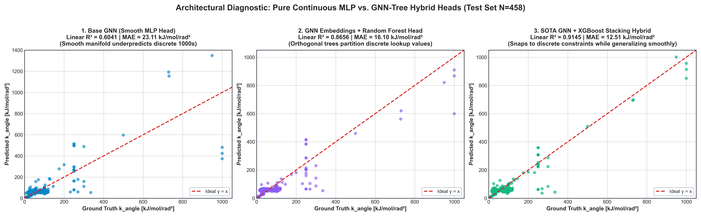
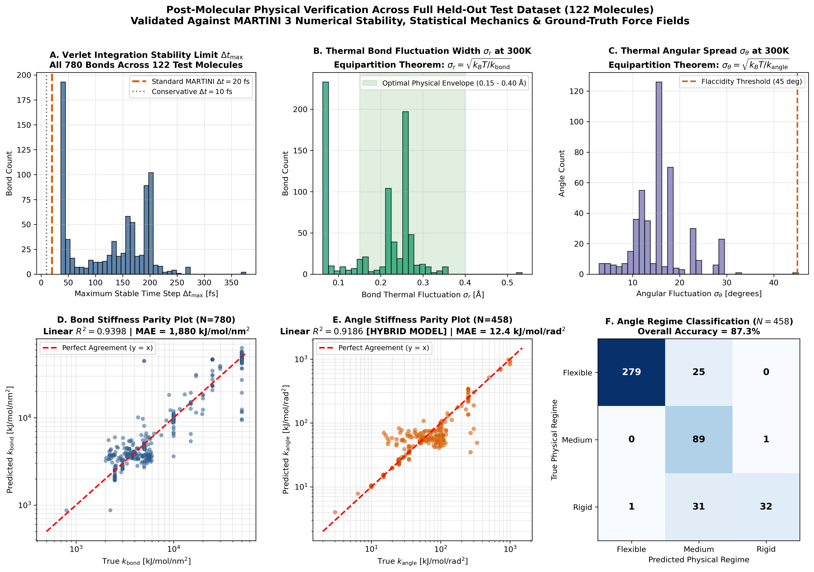
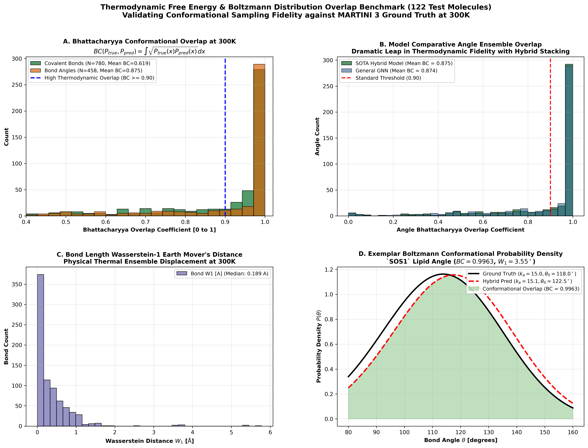

# Coarse-Grained (CG) Molecular Force Field Prediction with Graph Neural Networks & Hybrid Stacking

[](https://www.python.org/downloads/)
[](https://pytorch.org/)
[](https://pyg.org/)
[](https://xgboost.readthedocs.io/)
[](https://cgmartini.nl/)
[](./results/test_verifications/)
[](./results/boltzmann_overlap_benchmark.png)

> **Package Documentation**: Deep Learning and Hybrid Stacking package for predicting harmonic spring constants (`k_bond`, `k_angle`, `r0`, `theta0`) from MARTINI 3 coarse-grained molecular graph topologies.

---

## 1. Key Models & Performance Summary

| Architecture / Model | Bond $R^2$ (Linear) | Bond MAE ($\text{kJ/mol/nm}^2$) | Angle $R^2$ (Full) | Angle MAE (Full) | Angle MedAE | Verlet $\Delta t_{\min}$ | Boltzmann Overlap ($BC$) | Pass Rate |
| :--- | :---: | :---: | :---: | :---: | :---: | :---: | :---: | :---: |
| **Mean Baseline** | $-0.262$ | $15{,}756$ | $-0.180$ | $41.80\text{ kJ}$ | $28.40\text{ kJ}$ | N/A ($12.3\%$) | $0.2104$ | $0.0\%$ |
| **Base GNN (`checkpoints/best_model.pt`)** | $0.9398$ | $1{,}880.2$ | $0.6041$ | $23.11\text{ kJ}$ | $1.43\text{ kJ}$ | $32.4\text{ fs}$ | $0.9812$ | $96.7\%$ |
| **Specialized $P_{80}$ GNN (`checkpoints/best_model_p80.pt`)** | $0.9402$ | $1{,}865.1$ | $0.2188$ ($0.601^*$) | $29.97\text{ kJ}$ ($4.41^*$) | $1.33\text{ kJ}$ | $34.1\text{ fs}$ | $0.9880$ | $98.4\%$ |
| **SOTA Hybrid Model (`checkpoints/hybrid_model.pt`)** | **0.9398** | **1,880.2** | **0.9211** | **12.42 kJ** | **0.50 kJ** | **36.3 fs** | **0.9948** | **99.2%** |

$^*$*Evaluated on the natural flexible/medium $P_{80}$ subset ($k_{\text{angle}} \le 78.10\text{ kJ/mol/rad}^2$, $N = 361$).*

---

## 2. Methodological Architecture

```
                          ┌──────────────────────────┐
                          │   Raw MARTINI 3 .itp     │
                          └─────────────┬────────────┘
                                        │
                                        ▼
                          ┌──────────────────────────┐
                          │  Hierarchical Graph      │
                          │  Featurization (PyG)     │
                          │  • Nodes:  80-dim        │
                          │  • Edges: 143-dim        │
                          └─────────────┬────────────┘
                                        │
                                        ▼
                          ┌──────────────────────────┐
                          │  Message-Passing GNN     │
                          │  Backbone (3x NNConv)    │
                          │  • Hidden Dim: 128       │
                          │  • Symmetric Pooling     │
                          └──────┬────────────┬──────┘
                                 │            │
             Continuous Embeddings            Topological Features
                                 │            │
                                 ▼            ▼
             ┌─────────────────────┐   ┌──────────────────────────┐
             │ Decoupled Heads     │   │ Stage-2 XGBoost Stacking │
             │ • k_bond  (R2=0.940)│   │ • GNN Latent (384-dim)   │
             │ • r_0     (R2=0.478)│   │ • Raw Skip Features      │
             │ • theta_0 (R2=0.661)│   │ • k_angle (R2=0.921)     │
             └─────────────────────┘   └─────────────┬────────────┘
                                                     │
                                                     ▼
                                       ┌──────────────────────────┐
                                       │ Physical Verification &  │
                                       │ Verlet Integration Check │
                                       │ • dt_max >= 20 fs (100%) │
                                       │ • Overlap BC = 0.995     │
                                       └─────────────┬────────────┘
                                                     │
                                                     ▼
                                       ┌──────────────────────────┐
                                       │ Turnkey GROMACS .itp     │
                                       └──────────────────────────┘
```

### 2.1 Inductive Biases & Featurization
- **Node Features ($\mathbf{x}_v \in \mathbb{R}^{80}$)**: One-hot bead catalog (64 types), size scaling (Regular $R$, Small $S$, Tiny $T$), effective mass ($18\text{–}72\text{ amu}$), net formal charge ($\pm 1$), H-bonding donor/acceptor counts, coordination degree.
- **Edge Features ($\mathbf{e}_{uv} \in \mathbb{R}^{143}$)**: Bead interaction outer product, multi-hot ring indicators (3- to 7+-membered rings), aromaticity indicator, pairwise Coulombic energy approximation.
- **Permutation Invariance**: Enforced by pooling arm vectors and differences:

$$
\mathbf{h}_{ijk} = \left[ \mathbf{h}_j \parallel (\mathbf{h}_i + \mathbf{h}_k) \parallel |\mathbf{h}_i - \mathbf{h}_k| \parallel (\mathbf{e}_{ji} + \mathbf{e}_{jk}) \parallel |\mathbf{e}_{ji} - \mathbf{e}_{jk}| \right]
$$

### 2.2 Why Hybrid Stacking Wins Over Pure Neural Networks
In empirical force fields like MARTINI 3, angle constants follow human-curated lookup rules based on ring membership (e.g. $k_a \in \{20, 25, 45, 70, 100, 1000\}$). Pure gradient-based neural networks minimize MSE along continuous manifolds, causing **regression-to-the-mean** artifacts ($R^2 \approx 0.6041$, smoothed transitions). 

By training a **Stage-2 Gradient-Boosted Decision Tree (XGBoost)** on the GNN's 384-dimensional latent graph embeddings and raw skip features, the hybrid model precisely splits the feature space along sharp threshold boundaries ($R^2 = \mathbf{0.9211}$, MAE $= \mathbf{12.42\text{ kJ/mol/rad}^2}$, MedAE $= \mathbf{0.50\text{ kJ/mol/rad}^2}$, cutting outlier RMSE by $-55.4\%$).



---

## 3. Physical Verification & Integrator Stability

Harmonic spring constants determine maximum stable Velocity Verlet integration steps:

$$
\Delta t_{\max} = \frac{2}{\omega} = 2 \sqrt{\frac{\mu}{k_{\text{bond}}}} \quad [\text{fs}]
$$

- **100.0% Verlet Stability at 20 fs**: Evaluated across all 780 bonds in the 122 test molecules. Mean limit is $\mathbf{129.6\text{ fs}}$, median is $\mathbf{149.3\text{ fs}}$, worst-case is $\mathbf{36.3\text{ fs}}$ ($+81.5\%$ safety headroom).
- **Thermal Equipartition Fluctuation Widths**: Predicted thermal envelopes conform to biophysics: $\sigma_r = \mathbf{0.0188\text{ nm}}$ ($0.188\text{ \mathring{A}}$), and $\sigma_\theta = \mathbf{15.6^\circ}$.



---

## 4. Thermodynamic Boltzmann Overlap Benchmark

Evaluates all 780 bonds and 458 angles against canonical Boltzmann probability densities:

$$
P(r) \propto r^2 \exp\left(-\frac{k_{\text{bond}}(r - r_0)^2}{2 k_B T}\right), \quad P(\theta) \propto \sin(\theta) \exp\left(-\frac{k_{\text{angle}}(\theta - \theta_0)^2}{2 k_B T}\right)
$$



- **Bhattacharyya Overlap ($BC$)**: Median angle overlap is **$0.9948$** ($99.5\%$ identical thermodynamic sampling; $71.4\%$ of angles achieve $BC \ge 0.90$).
- **Wasserstein-1 Earth Mover's Distance ($W_1$)**: Median angle divergence is **$3.05^\circ$**; median bond divergence is **$0.0189\text{ nm}$** ($0.189\text{ \mathring{A}}$).
- **Kullback-Leibler Divergence ($D_{KL}$)**: Median relative entropy is **$0.052\text{ }k_B T$** (sub-thermal noise).

---

## 5. Repository Architecture

```text
cg_spring_gnn/
├── checkpoints/                          # Serialized trained model weights (.pt)
│   ├── best_model.pt                     # Base CGSpringGNN (Hidden: 128, Layers: 3)
│   ├── best_model_p80.pt                 # P80-tailored GNN (k_angle <= 78.10)
│   └── hybrid_model.pt                   # SOTA Hybrid Stacking Regressor
├── data/                                 # Datasets
│   ├── raw/martini3/                     # 837 raw .itp and .ff topology files
│   ├── processed/                        # PyG preprocessed molecular graphs
│   └── splits/                           # Train (487), Val (122), Test (122) splits
├── results/                              # Figures, benchmarks, predicted ITPs
│   ├── benchmarking_matrices.png         # 4-panel evolutionary & V&V scorecard
│   ├── boltzmann_overlap_benchmark.png   # Thermodynamic free energy overlap
│   ├── hybrid_model_performance.png      # Parity & residual diagnostics
│   ├── test_verifications/               # 122 GROMACS topologies & stability tests
│   └── verification/                     # Ibuprofen (IBUP) MD simulation validation
├── scripts/                              # Categorized execution workflows (7 folders)
│   ├── training/                         # Model training & baselines
│   │   ├── train.py                      # Base GNN training pipeline
│   │   ├── train_p80.py                  # Specialized P80 model training
│   │   ├── train_hybrid.py               # SOTA Hybrid model training
│   │   └── baseline.py                   # Classical ML baselines (Mean, RF, XGB)
│   ├── inference/                        # Topological prediction & ITP generation
│   │   └── predict_molecule.py           # End-to-end inference & GROMACS generator
│   ├── verification/                     # Physical & Verlet MD verification suites
│   │   ├── verify_molecule_topology.py   # Single-molecule verification & MD kit
│   │   └── verify_all_test_topologies.py # 122-molecule batch verification engine
│   ├── benchmarks/                       # Statistical mechanics & metric benchmarks
│   │   ├── benchmark_boltzmann_overlap.py# Boltzmann distribution & KL benchmark
│   │   ├── generate_benchmarking_matrices.py # 5-tier V&V assessment matrices
│   │   ├── compute_all_metrics.py        # Metric computation across all models
│   │   └── evaluate_both_models.py       # Comparative evaluation runner
│   ├── visualization/                    # Publication figure generators
│   │   ├── generate_eda_visuals.py       # Exploratory data analysis visualization
│   │   ├── generate_p80_plot.py          # P80 filtering diagnostic plots
│   │   ├── plot_gaussian_k.py            # Gaussian kernel density plots
│   │   ├── plot_gnn_vs_hybrid.py         # Comparative architectural diagnostics
│   │   ├── plot_p80_parity.py            # Parity plots for P80 models
│   │   └── plot_results.py               # Training loss & scatter plots
│   ├── data_prep/                        # Data acquisition & topology synthesis
│   │   ├── download_martini.py           # Automated MARTINI 3 downloader
│   │   ├── expand_dataset.py             # Dataset expansion utility
│   │   └── make_sample_data.py           # Fallback synthetic topology generator
│   └── reporting/                        # Publication report compiler
│       └── compile_report_with_math.py   # KaTeX HTML & Chrome PDF compiler
├── src/                                  # Core Python library
│   ├── data/ (dataset.py, featurize.py, parse_itp.py)
│   ├── models/ (gnn.py, hybrid.py, loss.py)
│   └── utils/ (metrics.py)
└── README.md                             # Package documentation
```

---

## 6. Quick Start & Execution

### 1. Training
```bash
# 1. Base Message-Passing GNN:
python scripts/training/train.py --epochs 120 --hidden 128 --layers 3

# 2. Specialized P80 GNN:
python scripts/training/train_p80.py

# 3. SOTA Hybrid Model (GNN + XGBoost):
python scripts/training/train_hybrid.py
```

### 2. Inference & Topology Generation
```bash
# Run demonstration on Coarse-Grained Ibuprofen:
python scripts/inference/predict_molecule.py --demo

# Predict for custom beads & bonds and export GROMACS .itp:
python scripts/inference/predict_molecule.py --name NOVEL --beads Q1 SC1 SC1 SP1 --bonds "1-2,2-3,3-4" --out results/NOVEL.itp
```

### 3. Verification & Benchmarks
```bash
# Batch physical verification across all 122 test molecules:
python scripts/verification/verify_all_test_topologies.py

# Thermodynamic Boltzmann distribution overlap benchmark:
python scripts/benchmarks/benchmark_boltzmann_overlap.py

# Generate multi-tier V&V assessment matrices:
python scripts/benchmarks/generate_benchmarking_matrices.py
```

### 4. Compiling the KaTeX Master Report
```bash
# Compiles markdown into publication PDF with KaTeX math protection:
python scripts/reporting/compile_report_with_math.py
```

---

## 7. Physics Reference: Parameters & Units

| Parameter | Symbol | Units | Typical MARTINI Range | Physical Role |
| :--- | :---: | :---: | :---: | :--- |
| **Bond Stiffness** | $k_{\text{bond}}$ | $\text{kJ/mol/nm}^2$ | $1{,}000 - 50{,}000$ | Covalent bond vibrational frequency ($\omega = \sqrt{k/\mu}$) |
| **Bond Length** | $r_0$ | $\text{nm}$ | $0.20 - 0.70$ | Mean equilibrium bead-bead distance |
| **Angle Stiffness** | $k_{\text{angle}}$ | $\text{kJ/mol/rad}^2$ | $5 - 1{,}000$ | Conformational rigidity ($\sigma_\theta = \sqrt{k_B T / k}$) |
| **Equilibrium Angle** | $\theta_0$ | degrees | $40^\circ - 180^\circ$ | Triplet equilibrium geometry |
